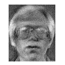
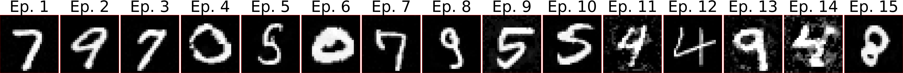
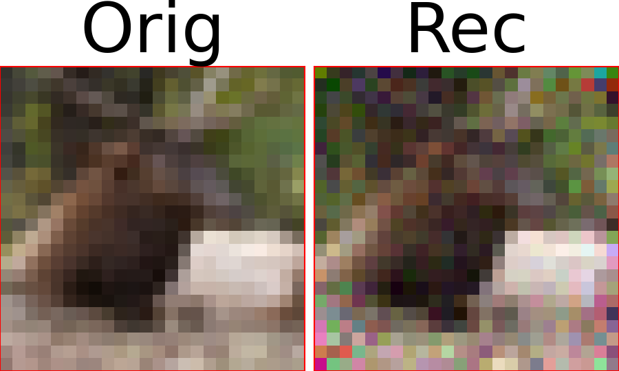

# Differentially Private Machine Learning

This repository contains all the code used in my [thesis](./Thesis_report.pdf) titled **"Privacy Preservation in Federated Learning"**.

## Thesis details

**Author:** Thomas Lagkalis  
**Committee:** Professor A.Liavas (Supervisor), Professor G.Karystinos, Professor T.Spyropoylos  
**Presentation Date:** 30/04/2026  
**University:** Technical University of Crete  

## (Short) Abstract

This thesis studies privacy risks in machine learning and federated learning, focusing on how sensitive training data can still be reconstructed through inference attacks even when raw data is not centralized. It explores the use of Differential Privacy as a principled framework to limit information leakage by adding calibrated noise during training, highlighting the resulting trade-off between privacy and model performance. The work analyzes output, objective, and gradient perturbation methods in softmax regression, and evaluates differentially private gradient mechanisms in federated learning settings. Privacy risks are experimentally assessed using Model Inversion and Deep Leakage from Gradients (DLG/iDLG) attacks on datasets such as MNIST and CIFAR-10, providing practical insight into how Differential Privacy mitigates reconstruction attacks while affecting accuracy and convergence in secure distributed learning systems.

## Table of Contents

- [kmeans/](./kmeans/): Experiments on differentially private K-means.
- [dp_average/](./dp_average/): Experiments on differentially private aggregation functions (average).
- [dp_LR/](./dp_LR/): Differentially private logistic regression.
- [M_class_LR/](./M_class_LR/): Multiclass logistic regression experiments.
- [dp_sgd/](./dp_sgd/): Differentially private SGD experiments.

## Reconstruction Examples
**Note:** For specific configurations and settings of the following reconstructions check the [report](./Thesis_report.pdf).

- Reconstruction of a face image from the ORL dataset in a softmax regression model using a Model Inversion Attack (MIA).

- Reconstructions of MNIST samples across training epochs of an MLP with one hidden layer using the Deep Leakage from Gradients (DLG) attack with a cosine similarity loss function.

- Reconstruction of a CIFAR-10 sample during the first training epoch of a simple CNN using the DLG attack.

